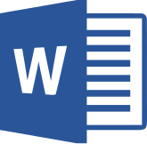

# officegen

Creating Office Open XML files (Word, Excel and Powerpoint) for Microsoft Office 2007 and later without external tools, just pure Javascript.
*officegen* should work on any environment that supports Node.js including Linux, OSX and Windows.
*officegen* also supporting PowerPoint *native* charts objects with embedded data.

[](https://badge.fury.io/js/officegen)
[](https://david-dm.org/Ziv-Barber/officegen)
[](https://david-dm.org/Ziv-Barber/officegen#info&#x3D;devDependencies)
[](https://travis-ci.org/Ziv-Barber/officegen)
[](https://gitter.im/officegen/Lobby?utm_source=badge&utm_medium=badge&utm_campaign=pr-badge&utm_content=badge) 


- [Getting Started](#getstart)
- [External dependencies](#dependencies)
- [Installation](#inst)
- [The API](#ref)
- [The source code](#code)
- [Credit](#credit)

<a name="getstart"></a>
## Getting Started: ##

[Trello](<https://trello.com/b/dkaiSGir/officegen-make-office-documents-in-javascript>)





### Officegen features overview:

- Generating Microsoft PowerPoint document (.pptx file):
  - Create PowerPoint document with one or more slides.
  - Support both PPT and PPS.
  - Can create native charts.
  - Add text blocks.
  - Add images.
  - Can declare fonts, alignment, colors and background.
  - You can rotate objects.
  - Support shapes: Ellipse, Rectangle, Line, Arrows, etc.
  - Support hidden slides.
  - Support automatic fields like date, time and current slide number.
  - Support speaker notes.
  - Support slide layouts.
- Generating Microsoft Word document (.docx file):
  - Create Word document.
  - You can add one or more paragraphs to the document and you can set the fonts, colors, alignment, etc.
  - You can add images.
  - Support header and footer.
  - Support bookmarks and hyperlinks.
- Generating Microsoft Excel document (.xlsx file):
  - Create Excel document with one or more sheets. Supporting cells with either numbers or strings.

### Contributors:

This project exists thanks to all the people who contribute.

<a name="dependencies"></a>
## External dependencies: ##

This project is using the following awesome libraries/utilities/services:

- archiver
- jszip
- lodash
- xmlbuilder

<a name="inst"></a>
## Installation: ##

via [**yarn**](https://yarnpkg.com/):

```bash
$ yarn add officegen
```

via **npm**:

```bash
$ npm install officegen
```

or if you are enthusiastic about using the latest that officegen has to offer (beware - may be unstable), you can install directly from the officegen repository using:

```bash
$ npm install Ziv-Barber/officegen#master
```

<a name="ref"></a>
## The API:

### Creating an officegen stream object:

First, make sure to require the officegen module:

```javascript
var officegen = require('officegen');
```

There are two ways to use the officegen returned function to create an officegen stream:

```javascript
var myDoc = officegen('<type of document to create>');

// or:

var myDoc = officegen({
  'type': '<type of document to create>'
  // More options here (if needed)
});

// Supported types:
// 'pptx' or 'ppsx' - Microsoft Powerpoint based document.
// 'docx' - Microsoft Word based document.
// 'xlsx' - Microsoft Excel based document.
```

Generating an empty Microsoft PowerPoint officegen stream:

```javascript
var pptx = officegen ( 'pptx' );
```

Generating an empty Microsoft Word officegen stream:

```javascript
var docx = officegen ('docx');
```

Generating an empty Microsoft Excel officegen stream:

```javascript
var xlsx = officegen ('xlsx');
```

General events of the officegen stream:

- 'finalize' - been called after finishing to create the document.
- 'error' - been called on error.

Event examples:

```javascript
pptx.on('finalize', function (written) {
  console.log('Finish to create a PowerPoint file.\nTotal bytes created: ' + written + '\n');
});

pptx.on('error', function (err) {
  console.log(err);
});
```

Another way to register either 'finalize' or 'error' events:

```javascript
var pptx = officegen({
  'type': 'pptx', // or 'xlsx', etc
  'onend': function (written) {
    console.log('Finish to create a PowerPoint file.\nTotal bytes created: ' + written + '\n');
  },
  'onerr': function (err) {
    console.log(err);
  }
});
```

If you are preferring to use callbacks instead of events you can pass your callbacks to the generate method
(see below).

Now you should fill the object with data (we'll see below) and then you should call generate with
an output stream to create the output Office document.

Example with pptx:

```javascript
var out = fs.createWriteStream('out.pptx');

pptx.generate(out);
out.on('close', function () {
  console.log('Finished to create the PPTX file!');
});
```

Passing callbacks to generate:

```javascript
var out = fs.createWriteStream('out.pptx');

pptx.generate(out, {
  'finalize': function (written) {
    console.log('Finish to create a PowerPoint file.\nTotal bytes created: ' + written + '\n');
  },
  'error': function (err) {
    console.log(err);
  }
});
```

Generating HTTP stream example (no file been created):

```javascript
var http = require('http');
var officegen = require('officegen');

http.createServer(function (request, response) {
  response.writeHead (200, {
    'Content-Type': 'application/vnd.openxmlformats-officedocument.presentationml.presentation',
    'Content-disposition': 'attachment; filename=surprise.pptx'
  });

  var pptx = officegen('pptx');

  pptx.on('finalize', function (written) {
    // We don't really need it in this case.
  });

  pptx.on('error', function (err) {
    // Error handing...
  });

  // ... (fill pptx with data)

  // Generate the Powerpoint document and sent it to the client via http:
  pptx.generate(response);
}).listen ( 3000 );
```

### Put data inside the document object: ###

#### MS-Office document properties (for all document types): ###

The default Author of all the documents been created by officegen is 'officegen'. If you want to put anything else please
use the 'creator' option when calling the officegen function:

```javascript
var pptx = officegen({
  'type': 'pptx', // or 'xlsx', etc.
  'creator': '<your project name here>'
});
```

Change the document title (pptx,ppsx,docx):

```javascript
var pptx = officegen({
  'type': 'pptx',
  'title': '<title>'
});

// or

pptx.setDocTitle('<title>');
```

For Word only:

```javascript
var docx = officegen({
  'type': 'docx',
  'subject': '...',
  'keywords': '...',
  'description': '...'
});

// or

docx.setDocSubject('...');
docx.setDocKeywords('...');
docx.setDescription('...');
```

#### Full manuel:

- [See here](manual)

### Examples:

- [make_pptx.js](examples/make_pptx.js) - Example how to create PowerPoint 2007 presentation and save it into file.
- [make_xlsx.js](examples/make_xlsx.js) - Example how to create Excel 2007 sheet and save it into file.
- [make_docx.js](examples/make_docx.js) - Example how to create Word 2007 document and save it into file.
- [pptx_server.js](examples/pptx_server.js) - Example HTTP server that generating a PowerPoint file with your name without using files on the server side.

### Debugging:

If needed, you can activate some verbose messages (warning: this does not cover all part of the lib yet) with :

```javascript
officegen.setVerboseMode(true);
```
### More documentations:

You can check the jsdoc documentation:

```bash
grunt jsdoc
```

### Support:

Please visit the officegen Google Group:

[officegen Google Group](https://groups.google.com/forum/?fromgroups#!forum/node-officegen)

Plans for the next release:
[Trello](<https://trello.com/b/dkaiSGir/officegen-make-office-documents-in-javascript>)

The Slack team:
[Slack](https://zivbarber.slack.com/messages/officegen/)

<a name="code"></a>
## :coffee: The source code: ##

### The project structure: ###

- office/index.js - The main file.
- office/lib/ - All the sources should be here.
  - basicgen.js - The generic engine to build many type of document files. This module providing the basicgen plugins interface for all the document generator. Any document generator MUST use this plugins API.
  - docplug.js - The document generator plugins interface - optional engine to create plugins API for each document generator.
  - msofficegen.js - A template basicgen plugin to extend the default basicgen module with the common Microsoft Office stuff. All the Microsoft Office based document generators in this project are using this template plugin.
  - genpptx.js - A document generator (basicgen plugin) to create a PPTX/PPSX document.
  - genxlsx.js - A document generator (basicgen plugin) to create a XLSX document.
  - gendocx.js - A document generator (basicgen plugin) to create a DOCX document.
  - pptxplg-*.js - docplug based plugins for genpptx.js ONLY to implement Powerpoint based features.
  - docxplg-*.js - docplug based plugins for genpptx.js ONLY to implement Powerpoint based features.
  - xlsxplg-*.js - docplug based plugins for genpptx.js ONLY to implement Powerpoint based features.
- officegen/test/ - All the unit tests.
- Gruntfile.js - Grunt scripts.

### Npm scripts: ###

When using with **yarn** then use the following syntax:

```bash
$ yarn name params
```

Or with just **npm**:

```bash
$ npm name params
```

- TBD.

<a name="credits"></a>
## Credit: ##

- Created by Ziv Barber in 2013.
- For creating zip streams i'm using 'archiver' by cmilhench, dbrockman, paulj originally inspired by Antoine van Wel's zipstream.
